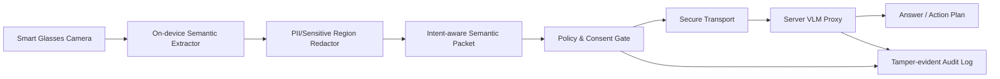

# XR Privacy Semantic AI Platform

**XR Privacy Semantic AI Platform**은 스마트글래스·XR 헤드셋의 카메라 스트림을 그대로 서버에 보내지 않고, 작업에 필요한 의미 정보만 추출·익명화·감사 가능한 형태로 전달하는 **privacy-preserving XR AI SDK + Edge Runtime + Server Governance Platform**입니다.

단순 MVP가 아니라 기업용 SDK/보안 모듈 라이선스화를 목표로 한 전문 시스템 구조입니다.

## 핵심 컨셉

기존 방식은 XR 카메라 프레임을 서버 VLM에 지속 업로드합니다. 이 방식은 개인정보 노출, 네트워크 비용, 배터리 소모, 규제 리스크가 큽니다. 본 시스템은 다음 구조로 전환합니다.



## 상용 시스템 구성

| 계층 | 역할 |
|---|---|
| `packages/xr_privacy_sdk` | XR 앱에 삽입하는 Python SDK. OCR/객체/레이아웃/민감정보/정책/감사/전송 모듈 포함 |
| `apps/edge_gateway` | 스마트글래스·로컬 디바이스에서 동작하는 Edge Runtime API |
| `apps/server` | VLM 질의 프록시, 정책 검증, 감사 로그 수집, 리스크 스코어링 API |
| `apps/dashboard` | DPO/보안담당자용 감사 대시보드 예시 |
| `configs` | 개인정보 정책, 전송 정책, 시나리오별 semantic profile |
| `docs` | 제품기획서, 아키텍처, 위협모델, API 계약, 평가계획 |
| `infra` | Docker Compose, 배포 기본 구성 |
| `tests` | SDK 핵심 모듈 단위 테스트 |

## 전문화 포인트

1. **Intent-aware Semantic Packet**  
   사용자의 작업 의도에 따라 텍스트만, 객체만, 문서 레이아웃만, 또는 결합 의미만 전송합니다.

2. **Raw-frame Non-retention 기본값**  
   원본 프레임은 서버로 보내지 않고, Edge Runtime에서도 기본적으로 디스크에 저장하지 않습니다.

3. **Privacy Policy Engine**  
   얼굴, 주민번호/전화번호/이메일/카드번호/화면 속 민감객체를 탐지하고 목적·권한·위치·네트워크 상태에 따라 전송을 차단하거나 축소합니다.

4. **Tamper-evident Audit Log**  
   모든 전송 패킷과 VLM 질의는 해시 체인 방식으로 감사 로그를 남깁니다.

5. **Enterprise SDK 모델**  
   XR 제조사, 산업 현장 안전 솔루션, 의료/교육 XR 앱에 SDK 또는 온프레미스 서버로 판매할 수 있습니다.

## 빠른 실행

```bash
cd xr_privacy_semantic_ai_platform
python -m venv .venv
source .venv/bin/activate
pip install -e packages/xr_privacy_sdk
pip install -r requirements-dev.txt
python scripts/generate_demo_packet.py
uvicorn apps.server.main:app --reload --port 8080
```

Edge Gateway 예시:

```bash
uvicorn apps.edge_gateway.main:app --reload --port 8070
```

## API 예시

```bash
curl -X POST http://localhost:8080/v1/vlm/query \
  -H 'Content-Type: application/json' \
  -d @examples/semantic_packet_document.json
```

## 주요 사용 시나리오

- 산업 현장: 장비 매뉴얼/경고표지 OCR만 전송하고 주변 작업자 얼굴은 제거
- 의료 XR: 환자명/차트번호는 Edge에서 마스킹하고 검사 절차 의미만 서버 질의
- 교육 XR: 학생 얼굴/노트 화면은 차단하고 문제 텍스트·판서 구조만 추출
- 물류/정비: 부품 객체와 위치 관계만 전송하여 VLM이 작업 지시 생성

## 수익모델

- XR 기업용 SDK 월 과금: 디바이스 수/MAU 기준
- 보안·컴플라이언스 모듈 라이선스
- 온프레미스 VLM Proxy 구축비
- 산업별 semantic profile 마켓플레이스
- 감사 로그/리스크 리포트 SaaS

## 로드맵

- v0.1: Mock extractor + PII redactor + audit log + FastAPI server
- v0.2: EasyOCR/YOLO/DocLayout 플러그인 연결
- v0.3: Android XR/Unity/OpenXR Bridge
- v0.4: 온디바이스 VLM/ONNX Runtime 지원
- v1.0: 기업 보안 정책 콘솔, SOC2/ISO27001 대응 로그, SDK 배포
