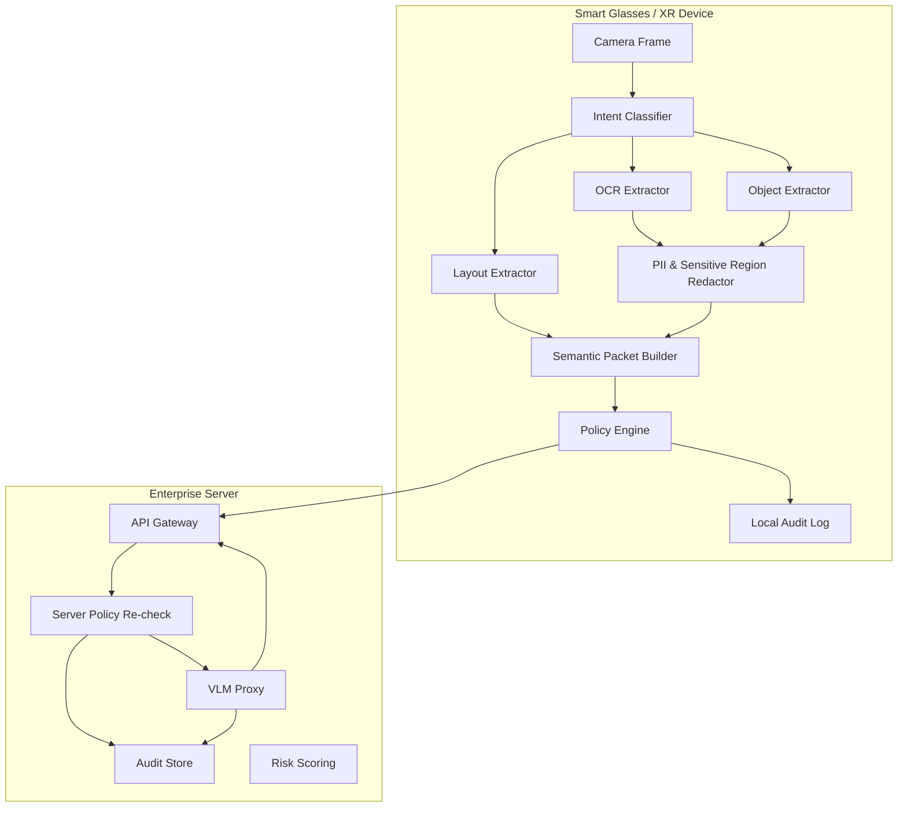

# Architecture

## 1. 전체 구조

## 2. Edge Runtime

Edge Runtime은 원본 프레임을 디스크에 저장하지 않는다. 카메라 프레임은 메모리에서 처리된 뒤 semantic packet으로 변환된다.

### Components

- `IntentClassifier`: 사용자 프롬프트를 보고 필요한 semantic mode 결정
- `OCRExtractor`: 텍스트만 필요한 경우 OCR 중심 추출
- `ObjectExtractor`: 정비/안전/물류처럼 객체 의미가 중요한 경우 사용
- `LayoutExtractor`: 문서/양식/슬라이드처럼 구조가 중요한 경우 사용
- `SensitiveDataRedactor`: PII 텍스트 제거
- `PolicyEngine`: 민감 객체 suppress, cloud block 판단
- `TamperEvidentAuditLog`: 전송 전 로컬 감사

## 3. Semantic Packet

Semantic Packet은 다음 속성을 가진다.

- `packet_id`, `device_id`, `session_id`
- `mode`, `user_intent`
- `extracted_texts`, `detected_objects`, `layout_regions`
- `privacy_actions`
- `risk_score`
- `raw_frame_retained=false`

원본 이미지 바이트는 필드에 포함하지 않는다.

## 4. Server VLM Proxy

서버는 semantic packet을 한 번 더 정책 검증한다. 정책을 통과한 packet만 VLM으로 전달한다. 이 구조는 SDK가 조작되거나 정책이 오래된 경우에도 서버 측 방어선을 제공한다.

## 5. Deployment Options

### SaaS
- XR 앱 → Edge SDK → Vendor Cloud VLM Proxy
- 스타트업 초기 수익화에 적합

### Enterprise On-prem
- 보안구역/의료/공공기관용
- VLM Proxy와 Audit Store를 고객사 내부망에 배치

### Hybrid
- low-risk packet만 cloud VLM
- high-risk packet은 on-device or on-prem VLM
